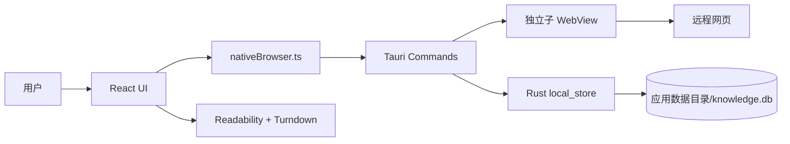
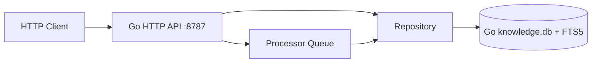
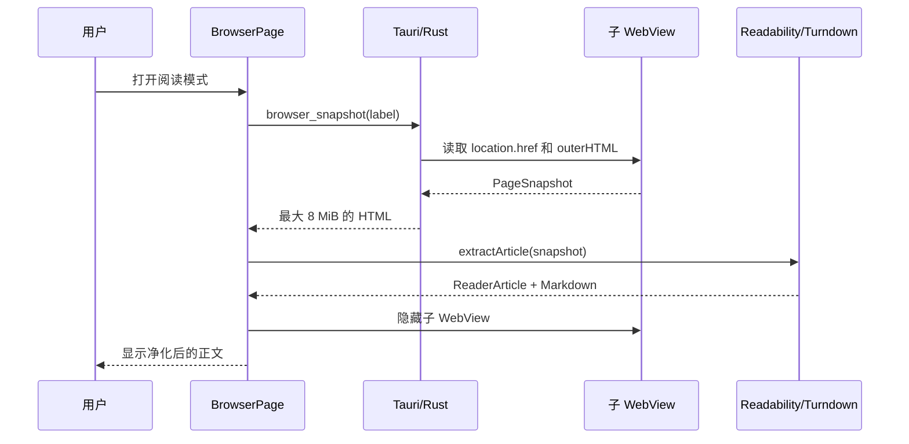
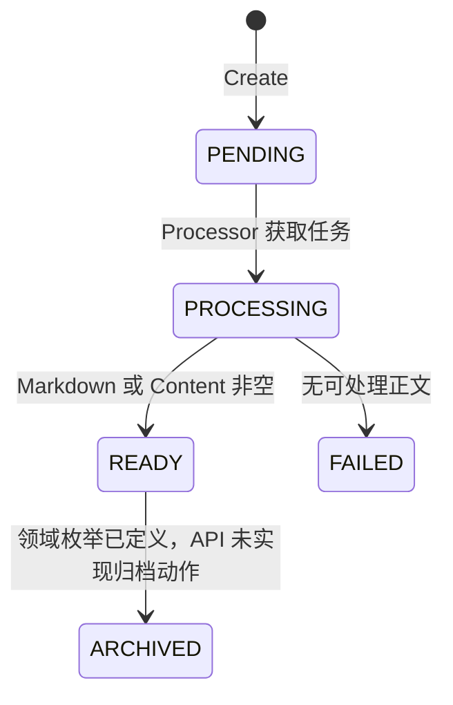
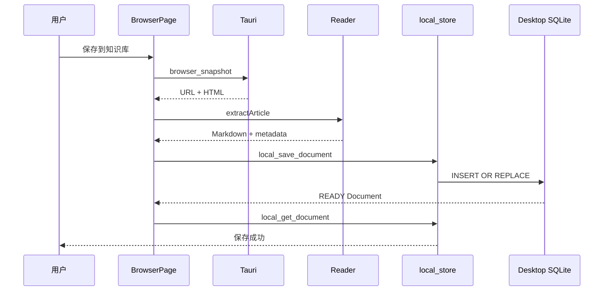
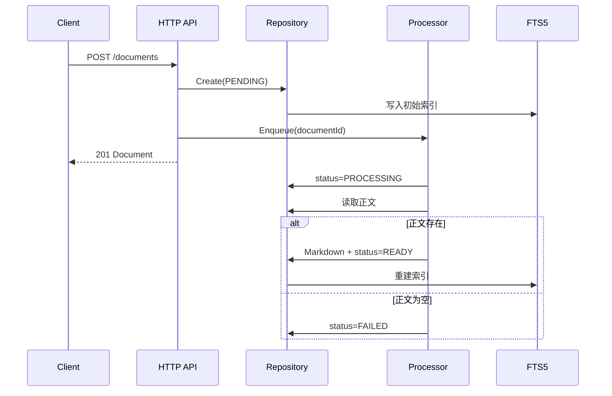

# Arcadia 开发技术文档

> 文档状态：基于 `main` 分支当前实现整理  
> 对应版本：`0.1.0`  
> 最后校验：2026-09-22

## 1. 文档目的

本文档面向参与 Arcadia（AI Knowledge Browser）开发、测试、维护和架构演进的工程师，描述当前代码真实实现，而不是仅描述产品愿景。

Arcadia 是一个基于 Tauri 2 的本地优先桌面知识浏览器。当前已打通以下核心闭环：

1. 在独立原生 WebView 中浏览网页。
2. 使用 Mozilla Readability 提取正文。
3. 将正文转换成 Markdown。
4. 保存到桌面应用的本地 SQLite。
5. 在知识库和搜索页面读取、查看和删除文档。

AI Provider、跨文档问答、隐私拦截、同步和完整插件运行时仍处于接口或 UI 占位阶段。

## 2. 技术栈

| 层 | 技术 | 当前职责 |
| --- | --- | --- |
| 桌面 UI | React 19、TypeScript、Vite 6、Ant Design 6、SCSS | 页面、标签状态、阅读器、知识库和设置界面 |
| 桌面壳 | Tauri 2、Rust | 子 WebView、受控导航、页面快照、本地 SQLite、应用打包 |
| 内容处理 | Mozilla Readability、Turndown、React Markdown | 正文识别、HTML 清理、Markdown 转换和展示 |
| 可选服务 | Go 1.24、`net/http` | REST API、文档领域逻辑、后台处理队列 |
| 持久化 | `rusqlite`、`modernc.org/sqlite`、SQLite FTS5 | 桌面本地文档；可选服务端文档和全文索引 |
| 测试 | Vitest、Cargo test、Go test | 前端测试框架、Rust 单元测试、Go API/Repository/Processor 测试 |

## 3. 仓库结构

```text
.
├── desktop/
│   ├── src/                         # React/TypeScript UI
│   │   ├── app/                     # 视图路由
│   │   ├── features/                # Reader、文档组件与服务
│   │   ├── layouts/                 # 应用外壳和可调整侧栏
│   │   ├── pages/                   # Browser、Library、Search、AI、Settings
│   │   ├── services/                # Tauri 原生浏览器适配器
│   │   ├── shared/                  # 通用 UI
│   │   ├── api.ts                   # 桌面本地数据访问入口
│   │   └── types.ts                 # 前端共享类型
│   └── src-tauri/
│       ├── capabilities/            # 主窗口最小权限
│       ├── src/browser/             # URL 规范化
│       ├── src/plugins/             # 插件模型和占位运行时
│       ├── src/lib.rs               # Tauri commands 与启动入口
│       └── src/local_store.rs       # 桌面 SQLite
├── backend/
│   ├── cmd/server/                  # Go 服务入口
│   ├── internal/ai/                 # AI 抽象接口
│   ├── internal/document/           # 文档模型、Repository 和 Processor
│   ├── internal/httpapi/            # REST API
│   ├── internal/storage/            # Go SQLite 初始化
│   └── migrations/                  # 目标数据库结构参考
├── docs/                            # 产品、架构、API、路线图和本文档
└── specs/                           # 需求规格、计划和任务拆分
```

## 4. 当前运行架构

### 4.1 默认桌面路径



桌面应用不依赖 Go 服务即可完成浏览、正文提取、保存、列表、详情、搜索和删除。`desktop/src/api.ts` 通过 Tauri `invoke` 调用 `local_*` commands；纯 Web 开发模式没有原生存储，因此列表为空、网页区域使用预览内容。

### 4.2 可选 Go 服务路径



Go 服务提供更完整的领域模型、FTS5 和进程内后台队列，但当前 React 桌面端没有将其作为默认数据源，也没有自动启动 sidecar。桌面 SQLite 和 Go SQLite 是两个独立数据库。

### 4.3 边界原则

- 远程网页运行在独立子 WebView 中，不直接获得 Tauri privileged command 权限。
- React UI 只通过受控 command 获取网页状态、快照和本地数据。
- Rust 层拒绝非 `http`/`https` 导航。
- AI、插件和同步相关接口目前不能被视为已上线能力。

## 5. 前端应用

### 5.1 启动和路由

启动链为：

```text
main.tsx → App.tsx → AppRouter.tsx → AppLayout.tsx → 页面组件
```

`AppRouter` 使用本地 React state 切换五个视图，而不是 URL Router：

| View | 页面 | 状态 |
| --- | --- | --- |
| `browser` | `BrowserPage` | 可用 |
| `library` | `LibraryPage` | 可用 |
| `search` | `SearchPage` | 可用，桌面端为 SQLite LIKE 搜索 |
| `ai` | `AssistantPage` | 数据源展示可用，问答未接通 |
| `settings` | `SettingsPage` | 大部分为占位，Provider 表单未持久化 |

所有路由级页面通过 `React.lazy` 加载。`AppLayout` 的左侧导航宽度可在 72–320 px 之间拖动，并通过 CSS 变量 `--sider-width` 通知布局。

### 5.2 浏览器标签模型

标签类型定义在 `desktop/src/types.ts`：

```ts
interface BrowserTab {
  id: string
  url: string
  title: string
  favicon?: string
  loading: boolean
  active: boolean
  pinned: boolean
}
```

每个标签对应一个命名为 `browser-{tabId}` 的 Tauri 子 WebView。前端维护 `tabId → webview label` 映射。标签切换时隐藏旧 WebView、显示新 WebView；关闭标签时销毁对应 WebView。

页面状态每 750 ms 通过 `browser_state` 轮询，更新 URL、标题、favicon 和加载状态。内容区域尺寸由 `ResizeObserver` 监听，并同步到子 WebView。

支持的快捷键：

| 快捷键 | 行为 |
| --- | --- |
| `Ctrl/Cmd + T` | 新建标签 |
| `Ctrl/Cmd + W` | 关闭当前标签 |
| `Ctrl/Cmd + L` | 聚焦地址栏 |
| `Ctrl/Cmd + Tab` | 下一个标签 |
| `Ctrl/Cmd + Shift + Tab` | 上一个标签 |
| `Ctrl/Cmd + 1…9` | 定位标签，9 表示最后一个 |
| `Ctrl/Cmd + R` / `F5` | 刷新 |
| `Alt + ←/→` | 后退/前进 |
| `Esc` | 停止加载 |

### 5.3 导航规则

UI 当前按以下规则处理地址栏：

- 以 `http://` 或 `https://` 开头：直接导航。
- 其他输入：转换成 Google 搜索 URL。

Rust 的 `normalize_navigation` 还支持将包含点号且不含空格的输入补全为 HTTPS 域名。真正创建或导航 WebView 前，`external_url` 再次验证协议，只允许 HTTP 和 HTTPS。

网页中的 `target="_blank"` 和 `window.open()` 会触发 `browser://new-tab` 事件，由 React 在应用内创建新标签；原始新窗口请求被拒绝。

### 5.4 Reader 流水线



`extractArticle` 的处理步骤：

1. 使用 `DOMParser` 创建独立文档。
2. 注入 `<base>`，用于解析相对资源地址。
3. 使用 Mozilla Readability 提取主内容。
4. 删除 `script`、`style`、`iframe`、`object`、`embed`、`form` 等元素。
5. 删除所有 `on*` 事件属性。
6. 只保留解析为 HTTP/HTTPS 的 `src` 和 `href`。
7. 使用 Turndown 转换成 ATX 标题、fenced code block 风格的 Markdown。

如果 Readability 没有返回有效内容，抛出 `reader_content_not_found`。

### 5.5 本地文档访问

`desktop/src/api.ts` 是桌面端唯一的数据访问入口：

| 前端函数 | Tauri command | 行为 |
| --- | --- | --- |
| `listDocuments(query)` | `local_list_documents` | 列表和字段模糊匹配，按收藏优先 |
| `saveDocument(input)` | `local_save_document` | 生成本地 ID 后写入 |
| `getDocument(id)` | `local_get_document` | 读取详情 |
| `deleteDocument(id)` | `local_delete_document` | 删除文档 |
| `toggleStarred(id, starred)` | `local_toggle_starred` | 切换收藏标记，文档不存在时报错 |
| `getSession(key)` / `setSession(key, value)` | `local_get_session` / `local_set_session` | 通用 K/V；非 Tauri 模式 get 返回 null、set no-op |
| `exportBackup()` / `importBackup(backup)` | `local_export_backup` / `local_import_backup` | 导出 / 导入本地文档 + 会话状态为备份；版本号必须为 1；非 Tauri 模式导出空、导入返回零计数 |

本地文档 ID 为 `local-{crypto.randomUUID()}`，保存时直接标记为 `READY`。当前保存逻辑仍保留状态轮询，但本地路径第一次读取通常即可得到 `READY`。

`BrowserPage.save()` 已在 Reader 抽取失败或正文为空时抛错并以 `error` 提示取消保存，不再写入占位文本。

## 6. Tauri/Rust 层

### 6.1 Commands

| Command | 参数 | 返回 | 说明 |
| --- | --- | --- | --- |
| `validate_navigation` | `url` | 规范化 URL | 当前前端未直接使用 |
| `browser_create` | `label, url, bounds` | `()` | 创建子 WebView |
| `browser_navigate` | `label, url` | URL | 受控导航 |
| `browser_reload` | `label` | `()` | 刷新 |
| `browser_stop` | `label` | `()` | 执行 `window.stop()` |
| `browser_history` | `label, delta` | `()` | 只接受 `-1` 或 `1` |
| `browser_state` | `label` | `BrowserState` | URL、标题、favicon、加载状态 |
| `browser_snapshot` | `label` | `PageSnapshot` | URL 和完整 HTML，限制 8 MiB |
| `local_list_documents` | `query` | `LocalDocument[]` | 本地列表/搜索，按 `starred DESC, created_at DESC` |
| `local_save_document` | `document` | `LocalDocument` | `INSERT OR REPLACE` |
| `local_get_document` | `id` | 文档或 `null` | 本地详情 |
| `local_delete_document` | `id` | `()` | 本地删除 |
| `local_toggle_starred` | `id, starred` | `bool` | 更新收藏标记；0 行更新则返回错误 |
| `local_get_session` | `key` | `string` 或 `null` | 通用 K/V 读取 |
| `local_set_session` | `key, value` | `()` | 通用 K/V 写入（upsert） |
| `local_export_backup` | — | `LocalBackup` | 导出 `{ version, exportedAt, documents, session }` |
| `local_import_backup` | `backup` | `LocalImportSummary` | 导入文档 + 会话；非 v1 版本返回错误 |
| `local_migration_status` | — | `{ version, pending }` | 当前 schema 版本与待迁移数 |

WebView 脚本通过 `eval_with_callback` 执行，等待上限为 5 秒。command 错误目前以字符串传回前端。

### 6.2 Capability 与 CSP

主窗口 capability 只开放默认核心权限和子 WebView 的创建、定位、调整大小、显示、隐藏、关闭权限。

应用 CSP：

```text
default-src 'self';
connect-src 'self' http://127.0.0.1:8787;
img-src 'self' asset: https: data:;
style-src 'self' 'unsafe-inline' https://fonts.googleapis.com;
font-src https://fonts.gstatic.com
```

子 WebView 加载的远程网页与可信应用 UI 是不同的安全上下文。新增 command 时必须同时评估：调用方是否为可信窗口、参数是否需要白名单、是否需要 capability，以及返回内容是否可能包含敏感信息。

## 7. 数据存储

### 7.1 桌面本地数据库

数据库文件：Tauri 应用数据目录下的 `knowledge.db`。应用标识为 `com.arcadia.knowledge-browser`。

表 `local_documents`：

| 字段 | 类型 | 约束/含义 |
| --- | --- | --- |
| `id` | TEXT | 主键 |
| `title` | TEXT | 非空 |
| `url` | TEXT | 非空 |
| `source` | TEXT | 可空 |
| `author` | TEXT | 可空 |
| `summary` | TEXT | 可空 |
| `markdown` | TEXT | 可空 |
| `word_count` | INTEGER | 默认 0 |
| `status` | TEXT | 前端状态枚举 |
| `tags` | TEXT | JSON 数组字符串 |
| `created_at` | TEXT | ISO 时间字符串 |
| `starred` | INTEGER | 收藏标记，0/1，索引 `idx_local_documents_starred (starred DESC, created_at DESC)`（v2 迁移加入） |

查询使用 `LIKE '%query%'` 匹配 title、markdown、summary 和序列化后的 tags，按 `starred DESC, created_at DESC` 排序，收藏文档优先。Schema 版本与迁移由 `schema_version` 表 + `MIGRATIONS` 常量管理，每次 `connection()` 调用 `run_migrations` 自动推进；`local_migration_status` command 暴露当前版本与 pending 数量。

通用 K/V 表 `local_session (key, value, updated_at)`（v3 迁移加入）支持 `local_get_session` / `local_set_session` commands，用于 BrowserPage 在挂载时恢复 tabs 与 activeTabId，变更后 500ms debounce 落盘。

`local_documents` + `local_session` 全量导出为 JSON（`local_export_backup`），按文档 id 做 upsert 导入（`local_import_backup`），设置页"知识库"标签内提供"导出备份" / "从文件恢复"按钮（基于 Blob 下载 + HTML input file，无需 fs 插件）。备份结构 `version=1`、保留时间戳与两类数据。FTS5、分页仍未引入。

### 7.2 Go 服务数据库

Go 服务默认使用 `backend/data/knowledge.db`，可通过 `AKB_DATA_DIR` 修改。连接启用：

- foreign keys
- WAL journal mode
- 5000 ms busy timeout

实际运行时由 `internal/storage/sqlite.go` 内嵌 schema 建表，包括：

- `documents`
- `tags`
- `document_tags`
- `documents_fts`

`backend/migrations/001_init.sql` 还声明了 collections、chunks、assets，但当前 `storage.Open()` 不读取该迁移文件，因此这些表不会仅因启动服务而创建。开发时应以运行时代码为准，或先统一迁移机制。

### 7.3 双存储差异

| 能力 | 桌面 SQLite | Go SQLite |
| --- | --- | --- |
| 默认被 React 使用 | 是 | 否 |
| 文档 CRUD | 是 | 是 |
| 搜索 | SQL `LIKE` | FTS5 |
| 标签关系表 | 否，JSON 字符串 | 是 |
| 状态处理队列 | 否，保存即 READY | 是，进程内队列 |
| 数据同步 | 不支持 | 不支持 |

严禁假设两个 `knowledge.db` 是同一个数据库或会自动同步。

## 8. Go 后端

### 8.1 启动生命周期

`backend/cmd/server/main.go`：

1. 监听 `SIGINT`/`SIGTERM`。
2. 读取监听地址和数据目录。
3. 打开 SQLite 并执行内嵌迁移。
4. 创建 `SQLiteRepository`。
5. 创建容量 128 的 `Processor`。
6. 启动 Processor goroutine。
7. 在 loopback 地址启动 HTTP 服务。

环境变量：

| 变量 | 默认值 | 说明 |
| --- | --- | --- |
| `AKB_ADDR` | `127.0.0.1:8787` | HTTP 监听地址 |
| `AKB_DATA_DIR` | `data` | 相对当前工作目录的数据目录 |

### 8.2 Repository

`Repository` 定义 `Create/List/Get/Update/Delete`。实现包括：

- `MemoryRepository`：测试和轻量运行使用，进程退出即丢失。
- `SQLiteRepository`：生产型 Go 存储，实现事务、标签关系和 FTS5 更新。

SQLite Create/Update/Delete 会在同一事务内维护主表、标签和 FTS 索引。搜索将输入拆成词项，转义双引号后生成 `"term"* AND ...` 查询。

### 8.3 文档状态机



Processor 使用有界 channel 和 `sync.Map` 去重：

- 相同文档已排队时，重复 `Enqueue` 返回成功但不重复入队。
- 队列满时返回 false，HTTP 创建接口返回 `503 queue_full`。
- 队列只存在于进程内，没有持久化、重试、崩溃恢复或多 Worker。
- 更新失败只写日志，没有结构化错误上报。

## 9. HTTP API

Base URL：`http://127.0.0.1:8787/api/v1`

统一错误结构：

```json
{
  "error": {
    "code": "validation_error",
    "message": "title and url are required"
  }
}
```

请求 JSON 限制为 1 MiB，并拒绝未知字段。

### 9.1 已实现端点

| 方法 | 路径 | 说明 |
| --- | --- | --- |
| GET | `/health` | 健康状态和版本 |
| GET | `/documents?q=` | 文档列表/搜索 |
| POST | `/documents` | 创建并尝试入处理队列 |
| GET | `/documents/{id}` | 文档详情 |
| PUT | `/documents/{id}` | 更新可编辑字段 |
| DELETE | `/documents/{id}` | 删除文档，成功返回 204 |
| GET | `/search?q=` | keyword 搜索 |
| POST | `/search` | `{ "query": "..." }` |
| POST | `/knowledge/search` | 当前复用 keyword 搜索 |
| GET | `/knowledge` | 文档、标签、集合数量 |
| GET | `/plugins` | 返回空列表和 runtime 不可用状态 |

### 9.2 占位端点

以下端点固定返回 `501 provider_not_configured`：

- `POST /ai/chat`
- `POST /ai/summary`
- `POST /ai/translate`
- `POST /agent/run`

AI 包仅定义 `LLM`、`Embedding`、`Reranker` 接口，没有 Provider 实现、配置加载、密钥存储或流式响应。

### 9.3 CORS

当前固定允许来源 `http://localhost:1420`，允许 `GET, POST, PUT, DELETE, OPTIONS`，允许 `Content-Type` 和 `Authorization` 请求头。当前 API 没有实际 bearer token 验证，因此只能视为开发期接口。

## 10. 关键业务流程

### 10.1 网页保存到桌面知识库



### 10.2 Go API 文档处理



## 11. 本地开发

### 11.1 环境要求

- Node.js 20+
- npm
- Rust stable 与 Cargo
- Tauri 2 对应平台编译依赖
- Windows：Microsoft Edge WebView2 Runtime
- 可选：Go 1.24

### 11.2 安装与启动

```bash
cd desktop
npm install
npm run tauri:dev
```

仅启动 Web UI：

```bash
cd desktop
npm run dev
```

纯 Web 模式只用于 UI 开发，不能验证真实子 WebView、页面快照、Tauri command 或桌面 SQLite。

启动可选 Go API：

```bash
cd backend
go run ./cmd/server
```

### 11.3 构建

```bash
cd desktop
npm run build
npm run tauri:build
```

安装包位于 Tauri target 的 `release/bundle` 目录。

## 12. 测试与质量门禁

建议提交前执行：

```bash
# 前端
cd desktop
npm run test
npm run build

# Rust
cd desktop/src-tauri
cargo fmt -- --check
cargo check
cargo test

# Go
cd backend
go test ./...
```

当前测试现状：

- Go：覆盖 health、创建校验、文档生命周期、SQLite 持久化/搜索/删除、Processor READY/FAILED。
- Rust：覆盖域名补全、搜索词转换和高权限协议拒绝。
- 前端：Vitest + happy-dom 已配置；共 41 个用例（`extractArticle` 6、`api.ts` 26、`useDebouncedValue` 5、`saveClassifier` 4），`npm run test` 通过。
- TypeScript 检查和 Vite 生产构建当前通过。

优先补充的前端测试：

1. `extractArticle` 的清理、相对 URL 和危险协议行为。
2. 浏览器标签创建、切换、关闭和快捷键。
3. `api.ts` 在 Tauri/非 Tauri 环境下的行为。
4. 搜索 250 ms debounce 和异常状态。
5. 保存失败、空正文和占位正文行为。

## 13. 安全设计与风险

### 13.1 已实现控制

- Rust 导航白名单只允许 HTTP/HTTPS。
- 网页新窗口转换为应用内标签。
- 页面快照限制为 8 MiB，脚本回调等待上限 5 秒。
- Reader 删除主动内容、嵌入内容、表单和 DOM 事件属性。
- Tauri capability 仅授予主窗口必需的 WebView 操作。
- HTTP JSON 限制为 1 MiB，并拒绝未知字段。
- SQLite 使用参数绑定，避免直接拼接用户值。

### 13.2 尚未完成的安全能力

- Go API 没有每次启动生成的 session token。
- Provider API Key 尚未接入系统密钥环；设置页声明不等于已实现。
- 隐私面板中的“已拦截请求”是静态展示，不是真实统计。
- 没有网站级权限、下载处理、证书错误策略和外部协议确认。
- 页面 HTML 会被读取到可信 UI 进程；需持续审查 Reader 清理和渲染链。
- 日志没有统一的敏感信息清理中间件。

## 14. 已知限制与技术债

按优先级整理：

### P0：影响数据真实性或可靠性

1. ✅ 桌面保存失败时的占位 Markdown 可能造成伪正文（已在 `BrowserPage.save()` 改为 Reader 失败/空正文时直接报错并取消保存）。
2. ✅ 桌面数据库没有正式迁移版本（已引入 `schema_version` 表 + `MIGRATIONS` 常量 + `run_migrations` 启动钩子，附 `local_migration_status` command；老库自动打 v1 基线）。
3. ✅ 前端没有自动化测试（Vitest + happy-dom 已配置；`extractArticle` 6 用例 + `api.ts` 14 用例 + `useDebouncedValue` 5 用例，合计 25 个）。
4. Go Processor 队列不持久化，崩溃会丢失未处理任务。

### P1：阻碍架构演进

1. 桌面和 Go 双存储没有统一数据所有权或同步策略。
2. `migrations/001_init.sql` 与运行时内嵌 schema 不一致。
3. 桌面搜索仍是 LIKE，UI 文案“FTS5 SEARCH”与实际实现不一致。
4. Go API 未与桌面 sidecar 生命周期、随机端口和认证 token 集成。
5. HTTP API 没有分页，文档增长后会产生性能问题。

### P2：功能占位

1. AI 摘要、问答、翻译、自动标签。
2. Embedding、混合检索、Reranker 和带引用 RAG。
3. 隐私拦截与真实统计。
4. ⏳ 历史、书签、下载、会话恢复和标签拖拽 — 书签（收藏）与会话恢复已实现：`local_documents.starred` + 卡片星标按钮；`local_session` 通用 K/V + BrowserPage 挂载时恢复 tabs/activeTabId、500ms debounce 落盘。剩余：历史下载、标签拖拽。
5. 插件 Runtime、集合管理和归档入口。

## 15. 推荐演进顺序

1. 修复空正文保存：提取失败时明确失败，不写占位数据。
2. ✅ 桌面 SQLite 版本化迁移已完成；备份/恢复机制已实现（`local_export_backup` / `local_import_backup` + 设置页"知识库"标签，Blob 下载 + 文件 input）。
3. 决定唯一数据所有权：继续 Rust 本地优先，或正式引入 Go sidecar；在此之前不要同时扩展两套 schema。
4. ⏳ 补齐前端关键路径测试 — 已完成 `extractArticle` / `api.ts` / 搜索 debounce（抽出 `useDebouncedValue` hook）/ saveClassifier + 备份导入导出；剩 §12 优先级列表的标签快捷键 + 保存回归测试，需要组件级测试基础设施（@testing-library/react）后才能补。
5. 如果保留 Go sidecar，先完成 loopback token、随机端口、生命周期监管和统一迁移。
6. 接入系统密钥环后再实现 OpenAI-compatible/Ollama Provider。
7. 在稳定全文检索和引用模型后实现 RAG，最后扩展 Agent/Plugin。

## 16. 开发约定

- 页面不直接访问 SQLite，统一通过 `api.ts` 或明确的 service 层。
- 远程网页不得获得应用 privileged command。
- 新增 command 必须进行协议、路径、大小或枚举边界校验。
- 数据库变更必须带迁移、回滚/兼容说明和测试。
- 不得用演示数据掩盖服务或存储失败。
- AI 未配置或证据不足时必须返回明确错误，不生成伪结果。
- 涉及桌面原生能力的改动至少验证 TypeScript build、Cargo check 和相关测试。
- 涉及 Go API、Repository 或处理状态的改动必须运行 `go test ./...`。

## 17. 故障排查

### 桌面页面能打开，但无法保存

确认运行的是 `npm run tauri:dev` 而不是 `npm run dev`。纯 Web 模式没有 Tauri commands 和本地 SQLite。

### 阅读模式提示无法识别正文

常见原因包括登录页面、反爬虫页面、SPA 尚未渲染完成、正文在 iframe 中或页面不是文章型内容。检查 `browser_snapshot` 是否成功，并确认 HTML 未超过 8 MiB。

### 知识库为空

先确认页面已实际保存；桌面端不会自动读取 Go API 的数据库。若只启动 Go 服务并通过 REST 创建文档，桌面知识库仍可能为空。

### Go API 创建后返回 503

文档已经保存，但 Processor 队列已满。当前没有自动重试机制；需检查消费 goroutine、日志和队列压力。

### 搜索行为与 FTS5 不一致

确认使用的是哪条路径：桌面 UI 默认使用 `local_documents LIKE`；只有 Go `SQLiteRepository` 使用 FTS5。

## 18. 相关文档

- [产品需求](PRD.md)
- [系统架构](architecture.md)
- [HTTP API](api.md)
- [开发路线图](roadmap.md)
- [项目说明](../README.md)

