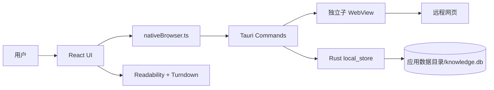
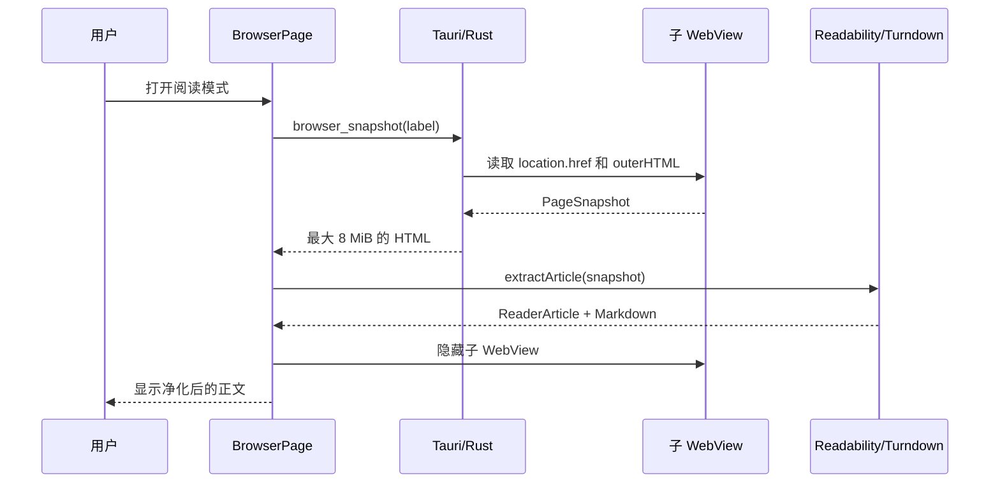
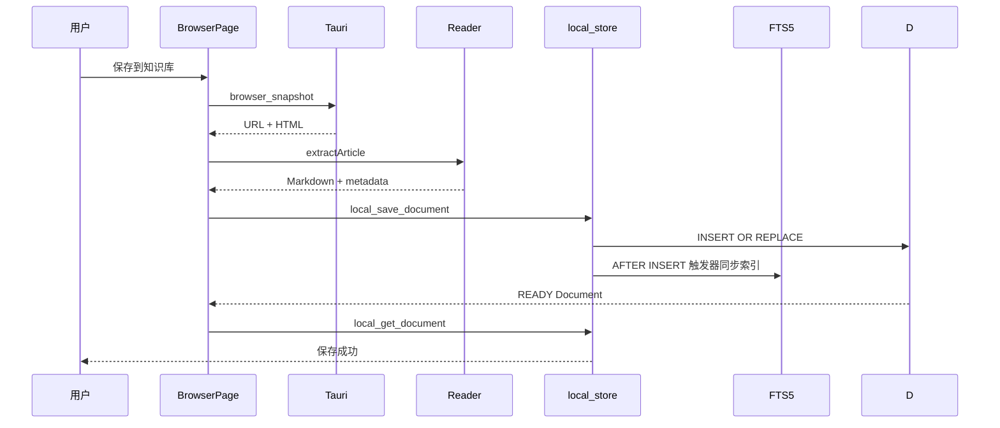
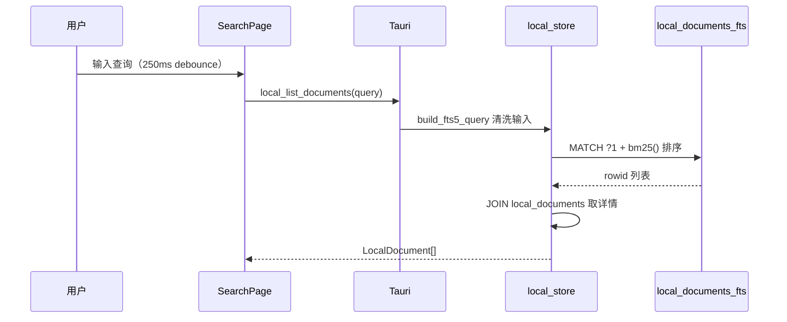

# Arcadia 开发技术文档

> 文档状态：基于 `main` 分支当前实现整理  
> 对应版本：`0.1.0`  
> 最后校验：2026-09-22

## 1. 文档目的

本文档面向参与 Arcadia（AI Knowledge Browser）开发、测试、维护和架构演进的工程师，描述当前代码真实实现，而不是仅描述产品愿景。

Arcadia 是一个基于 Tauri 2 的本地优先桌面知识浏览器。当前已打通以下核心闭环：

1. 在独立原生 WebView 中浏览网页。
2. 使用 Mozilla Readability 提取正文。
3. 将正文转换成 Markdown。
4. 保存到桌面应用的本地 SQLite。
5. 在知识库和搜索页面读取、查看和删除文档。

AI Provider、跨文档问答、隐私拦截、同步和完整插件运行时仍处于接口或 UI 占位阶段。

## 2. 技术栈

| 层 | 技术 | 当前职责 |
| --- | --- | --- |
| 桌面 UI | React 19、TypeScript、Vite 6、Ant Design 6、SCSS | 页面、标签状态、阅读器、知识库和设置界面 |
| 桌面壳 | Tauri 2、Rust | 子 WebView、受控导航、页面快照、本地 SQLite、应用打包 |
| 内容处理 | Mozilla Readability、Turndown、React Markdown | 正文识别、HTML 清理、Markdown 转换和展示 |
| 持久化 | `rusqlite` + SQLite **FTS5**（`local_documents_fts` 虚表 + 触发器同步） | 桌面本地文档、标签、集合、任务队列、AI Provider、下载、历史、书签、工作区、阅读活动、凭证 |
| 测试 | Vitest、Cargo test | 前端测试框架、Rust 单元测试 + 集成测试 |

## 3. 仓库结构

```text
.
├── desktop/
│   ├── src/                         # React/TypeScript UI
│   │   ├── app/                     # 视图路由
│   │   ├── features/                # Reader、文档组件与服务
│   │   ├── layouts/                 # 应用外壳和可调整侧栏
│   │   ├── pages/                   # Browser、Library、Search、AI、Settings
│   │   ├── services/                # Tauri 原生浏览器适配器
│   │   ├── shared/                  # 通用 UI
│   │   ├── api.ts                   # 桌面本地数据访问入口
│   │   └── types.ts                 # 前端共享类型
│   └── src-tauri/
│       ├── capabilities/            # 主窗口最小权限
│       ├── src/browser/             # URL 规范化
│       ├── src/plugins/             # 插件模型和占位运行时
│       ├── src/lib.rs               # Tauri commands 与启动入口
│       └── src/local_store.rs       # 桌面 SQLite + FTS5
├── docs/                            # 产品、架构、路线图和本文档
└── specs/                           # 需求规格、计划和任务拆分
```

## 4. 当前运行架构

### 4.1 默认桌面路径


```mermaid
flowchart LR
    U[用户] --> UI[React UI]
    UI --> NB[nativeBrowser.ts]
    NB --> TC[Tauri Commands]
    TC --> WV[独立子 WebView]
    WV --> WEB[远程网页]
    UI --> READER[Readability + Turndown]
    TC --> LS[Rust local_store]
    LS --> DB[(应用数据目录/knowledge.db)]
```

桌面应用不依赖 Go 服务即可完成浏览、正文提取、保存、列表、详情、搜索和删除。`desktop/src/api.ts` 通过 Tauri `invoke` 调用 `local_*` commands；纯 Web 开发模式没有原生存储，因此列表为空、网页区域使用预览内容。

### 4.2 边界原则

- 远程网页运行在独立子 WebView 中，不直接获得 Tauri privileged command 权限。
- React UI 只通过受控 command 获取网页状态、快照和本地数据。
- Rust 层拒绝非 `http`/`https` 导航。
- AI、插件和同步相关接口目前不能被视为已上线能力。

## 5. 前端应用

### 5.1 启动和路由

启动链为：

```text
main.tsx → App.tsx → AppRouter.tsx → AppLayout.tsx → 页面组件
```

`AppRouter` 使用本地 React state 切换五个视图，而不是 URL Router：

| View | 页面 | 状态 |
| --- | --- | --- |
| `browser` | `BrowserPage` | 可用 |
| `library` | `LibraryPage` | 可用 |
| `search` | `SearchPage` | 可用，桌面端为 SQLite **FTS5** + BM25 排序 + 前缀匹配 |
| `ai` | `AssistantPage` | 数据源展示可用，问答未接通 |
| `settings` | `SettingsPage` | 大部分为占位，Provider 表单未持久化 |

所有路由级页面通过 `React.lazy` 加载。`AppLayout` 的左侧导航宽度可在 72–320 px 之间拖动，并通过 CSS 变量 `--sider-width` 通知布局。

### 5.2 浏览器标签模型

标签类型定义在 `desktop/src/types.ts`：

```ts
interface BrowserTab {
  id: string
  url: string
  title: string
  favicon?: string
  loading: boolean
  active: boolean
  pinned: boolean
}
```

每个标签对应一个命名为 `browser-{tabId}` 的 Tauri 子 WebView。前端维护 `tabId → webview label` 映射。标签切换时隐藏旧 WebView、显示新 WebView；关闭标签时销毁对应 WebView。

页面状态每 750 ms 通过 `browser_state` 轮询，更新 URL、标题、favicon 和加载状态。内容区域尺寸由 `ResizeObserver` 监听，并同步到子 WebView。

支持的快捷键：

| 快捷键 | 行为 |
| --- | --- |
| `Ctrl/Cmd + T` | 新建标签 |
| `Ctrl/Cmd + W` | 关闭当前标签 |
| `Ctrl/Cmd + L` | 聚焦地址栏 |
| `Ctrl/Cmd + Tab` | 下一个标签 |
| `Ctrl/Cmd + Shift + Tab` | 上一个标签 |
| `Ctrl/Cmd + 1…9` | 定位标签，9 表示最后一个 |
| `Ctrl/Cmd + R` / `F5` | 刷新 |
| `Alt + ←/→` | 后退/前进 |
| `Esc` | 停止加载 |

### 5.3 导航规则

UI 当前按以下规则处理地址栏：

- 以 `http://` 或 `https://` 开头：直接导航。
- 其他输入：转换成 Google 搜索 URL。

Rust 的 `normalize_navigation` 还支持将包含点号且不含空格的输入补全为 HTTPS 域名。真正创建或导航 WebView 前，`external_url` 再次验证协议，只允许 HTTP 和 HTTPS。

网页中的 `target="_blank"` 和 `window.open()` 会触发 `browser://new-tab` 事件，由 React 在应用内创建新标签；原始新窗口请求被拒绝。

### 5.4 Reader 流水线


```mermaid
sequenceDiagram
    participant User as 用户
    participant UI as BrowserPage
    participant Rust as Tauri/Rust
    participant Web as 子 WebView
    participant Reader as Readability/Turndown

    User->>UI: 打开阅读模式
    UI->>Rust: browser_snapshot(label)
    Rust->>Web: 读取 location.href 和 outerHTML
    Web-->>Rust: PageSnapshot
    Rust-->>UI: 最大 8 MiB 的 HTML
    UI->>Reader: extractArticle(snapshot)
    Reader-->>UI: ReaderArticle + Markdown
    UI->>Web: 隐藏子 WebView
    UI-->>User: 显示净化后的正文
```

`extractArticle` 的处理步骤：

1. 使用 `DOMParser` 创建独立文档。
2. 注入 `<base>`，用于解析相对资源地址。
3. 使用 Mozilla Readability 提取主内容。
4. 删除 `script`、`style`、`iframe`、`object`、`embed`、`form` 等元素。
5. 删除所有 `on*` 事件属性。
6. 只保留解析为 HTTP/HTTPS 的 `src` 和 `href`。
7. 使用 Turndown 转换成 ATX 标题、fenced code block 风格的 Markdown。

如果 Readability 没有返回有效内容，抛出 `reader_content_not_found`。

### 5.5 本地文档访问

`desktop/src/api.ts` 是桌面端唯一的数据访问入口：

| 前端函数 | Tauri command | 行为 |
| --- | --- | --- |
| `listDocuments(query)` | `local_list_documents` | 列表与 FTS5 全文检索（`bm25()` 排序），空查询按收藏优先 |
| `saveDocument(input)` | `local_save_document` | 生成本地 ID 后写入 |
| `getDocument(id)` | `local_get_document` | 读取详情 |
| `deleteDocument(id)` | `local_delete_document` | 删除文档 |
| `toggleStarred(id, starred)` | `local_toggle_starred` | 切换收藏标记，文档不存在时报错 |
| `getSession(key)` / `setSession(key, value)` | `local_get_session` / `local_set_session` | 通用 K/V；非 Tauri 模式 get 返回 null、set no-op |
| `exportBackup()` / `importBackup(backup)` | `local_export_backup` / `local_import_backup` | 导出 / 导入本地文档 + 会话状态为备份；版本号必须为 1；非 Tauri 模式导出空、导入返回零计数 |

本地文档 ID 为 `local-{crypto.randomUUID()}`，保存时直接标记为 `READY`。当前保存逻辑仍保留状态轮询，但本地路径第一次读取通常即可得到 `READY`。

`BrowserPage.save()` 已在 Reader 抽取失败或正文为空时抛错并以 `error` 提示取消保存，不再写入占位文本。

## 6. Tauri/Rust 层

### 6.1 Commands

| Command | 参数 | 返回 | 说明 |
| --- | --- | --- | --- |
| `validate_navigation` | `url` | 规范化 URL | 当前前端未直接使用 |
| `browser_create` | `label, url, bounds` | `()` | 创建子 WebView |
| `browser_navigate` | `label, url` | URL | 受控导航 |
| `browser_reload` | `label` | `()` | 刷新 |
| `browser_stop` | `label` | `()` | 执行 `window.stop()` |
| `browser_history` | `label, delta` | `()` | 只接受 `-1` 或 `1` |
| `browser_state` | `label` | `BrowserState` | URL、标题、favicon、加载状态 |
| `browser_snapshot` | `label` | `PageSnapshot` | URL 和完整 HTML，限制 8 MiB |
| `local_list_documents` | `query` | `LocalDocument[]` | FTS5 `MATCH` 搜索（`bm25()` 排序），空查询按 `starred DESC, created_at DESC` |
| `local_save_document` | `document` | `LocalDocument` | `INSERT OR REPLACE` |
| `local_get_document` | `id` | 文档或 `null` | 本地详情 |
| `local_delete_document` | `id` | `()` | 本地删除 |
| `local_toggle_starred` | `id, starred` | `bool` | 更新收藏标记；0 行更新则返回错误 |
| `local_get_session` | `key` | `string` 或 `null` | 通用 K/V 读取 |
| `local_set_session` | `key, value` | `()` | 通用 K/V 写入（upsert） |
| `local_export_backup` | — | `LocalBackup` | 导出 `{ version, exportedAt, documents, session }` |
| `local_import_backup` | `backup` | `LocalImportSummary` | 导入文档 + 会话；非 v1 版本返回错误 |
| `local_migration_status` | — | `{ version, pending }` | 当前 schema 版本与待迁移数 |

WebView 脚本通过 `eval_with_callback` 执行，等待上限为 5 秒。command 错误目前以字符串传回前端。

### 6.2 Capability 与 CSP

主窗口 capability 只开放默认核心权限和子 WebView 的创建、定位、调整大小、显示、隐藏、关闭权限。

应用 CSP：

```text
default-src 'self';
connect-src 'self';
img-src 'self' asset: https: data:;
style-src 'self' 'unsafe-inline' https://fonts.googleapis.com;
font-src https://fonts.gstatic.com
```

子 WebView 加载的远程网页与可信应用 UI 是不同的安全上下文。新增 command 时必须同时评估：调用方是否为可信窗口、参数是否需要白名单、是否需要 capability，以及返回内容是否可能包含敏感信息。

## 7. 数据存储

### 7.1 桌面本地数据库

数据库文件：Tauri 应用数据目录下的 `knowledge.db`。应用标识为 `com.arcadia.knowledge-browser`。

表 `local_documents`：

| 字段 | 类型 | 约束/含义 |
| --- | --- | --- |
| `id` | TEXT | 主键 |
| `title` | TEXT | 非空 |
| `url` | TEXT | 非空 |
| `source` | TEXT | 可空 |
| `author` | TEXT | 可空 |
| `summary` | TEXT | 可空 |
| `markdown` | TEXT | 可空 |
| `word_count` | INTEGER | 默认 0 |
| `status` | TEXT | 前端状态枚举 |
| `tags` | TEXT | JSON 数组字符串 |
| `created_at` | TEXT | ISO 时间字符串 |
| `starred` | INTEGER | 收藏标记，0/1，索引 `idx_local_documents_starred (starred DESC, created_at DESC)`（v2 迁移加入） |

查询使用 `LIKE '%query%'` 匹配 title、markdown、summary 和序列化后的 tags，按 `starred DESC, created_at DESC` 排序，收藏文档优先。Schema 版本与迁移由 `schema_version` 表 + `MIGRATIONS` 常量管理，每次 `connection()` 调用 `run_migrations` 自动推进；`local_migration_status` command 暴露当前版本与 pending 数量。

通用 K/V 表 `local_session (key, value, updated_at)`（v3 迁移加入）支持 `local_get_session` / `local_set_session` commands，用于 BrowserPage 在挂载时恢复 tabs 与 activeTabId，变更后 500ms debounce 落盘。

`local_documents` + `local_session` 全量导出为 JSON（`local_export_backup`），按文档 id 做 upsert 导入（`local_import_backup`），设置页"知识库"标签内提供"导出备份" / "从文件恢复"按钮（基于 Blob 下载 + HTML input file，无需 fs 插件）。备份结构 `version=1`、保留时间戳与两类数据。

### 7.2 FTS5 全文索引（迁移 #17）

虚表 `local_documents_fts` 与 `local_documents` 通过 `content='local_documents'` 绑定，使用 `tokenize='unicode61'` 分词器，索引字段：`title`、`markdown`、`summary`、`tags`。迁移在主表 → 虚表之间挂三个触发器保持同步：

- `local_documents_ai` AFTER INSERT
- `local_documents_ad` AFTER DELETE
- `local_documents_au` AFTER UPDATE

查询时通过 `INNER JOIN local_documents_fts fts ON fts.rowid = d.rowid` 关联主表，`WHERE local_documents_fts MATCH ?1` 执行匹配，`ORDER BY bm25(local_documents_fts)` 使用 SQLite 内置 Okapi BM25 排序。用户输入经 `build_fts5_query` 清洗：剥离 `"`、`*`、`(`、`)`、`:`、`\`、`+`、`-`、`^` 等 FTS5 元字符，每个剩余词项用双引号包裹并附加 `*` 前缀通配符，多个词项 `AND` 组合。空查询或全部符号被剥离的查询降级为按 `starred DESC, created_at DESC` 全列表。

`local_documents` 主键是 TEXT，没有显式 INTEGER 主键，因此 FTS5 通过隐式 `rowid` 关联，`content_rowid='rowid'` 在 schema 中显式标注。

## 8. （已合并到 §7）

历史版本曾规划独立的 Go 后端提供文档 API、FTS5 和处理队列，但桌面应用从未真正调用该服务；Rust 端 `local_store.rs` 已经承担所有文档持久化与全文检索职责，Go 后端代码（`backend/`）已删除。如需远程同步或多端协作，应在 Rust 端构建独立服务，避免再次出现双存储。

## 9. （无独立 HTTP API）

桌面应用不暴露 HTTP API。所有读写均通过 Tauri commands（`local_*` / `browser_*` / `downloads_*` 等）由前端 `invoke` 调用。Rust 端不做入站网络服务。

## 10. 关键业务流程

### 10.1 网页保存到桌面知识库


```mermaid
sequenceDiagram
    participant U as 用户
    participant B as BrowserPage
    participant T as Tauri
    participant R as Reader
    participant L as local_store
    participant F as FTS5

    U->>B: 保存到知识库
    B->>T: browser_snapshot
    T-->>B: URL + HTML
    B->>R: extractArticle
    R-->>B: Markdown + metadata
    B->>L: local_save_document
    L->>D: INSERT OR REPLACE
    L->>F: AFTER INSERT 触发器同步索引
    D-->>B: READY Document
    B->>L: local_get_document
    L-->>U: 保存成功
```

### 10.2 全文检索


```mermaid
sequenceDiagram
    participant U as 用户
    participant UI as SearchPage
    participant T as Tauri
    participant L as local_store
    participant F as local_documents_fts

    U->>UI: 输入查询（250ms debounce）
    UI->>T: local_list_documents(query)
    T->>L: build_fts5_query 清洗输入
    L->>F: MATCH ?1 + bm25() 排序
    F-->>L: rowid 列表
    L->>L: JOIN local_documents 取详情
    L-->>UI: LocalDocument[]
```

## 11. 本地开发

### 11.1 环境要求

- Node.js 20+
- npm
- Rust stable 与 Cargo
- Tauri 2 对应平台编译依赖
- Windows：Microsoft Edge WebView2 Runtime

### 11.2 安装与启动

```bash
cd desktop
npm install
npm run tauri:dev
```

仅启动 Web UI：

```bash
cd desktop
npm run dev
```

纯 Web 模式只用于 UI 开发，不能验证真实子 WebView、页面快照、Tauri command 或桌面 SQLite。

### 11.3 构建

```bash
cd desktop
npm run build
npm run tauri:build
```

安装包位于 Tauri target 的 `release/bundle` 目录。

## 12. 测试与质量门禁

建议提交前执行：

```bash
# 前端
cd desktop
npm run test
npm run build

# Rust
cd desktop/src-tauri
cargo fmt -- --check
cargo check
cargo test
```

当前测试现状：

- Rust：覆盖域名补全、搜索词转换、高权限协议拒绝、`local_store` 17 个迁移（含 FTS5 触发器与回填）、下载/书签/会话锁/Provider base URL 校验等。共 49 用例，`cargo test --lib` 通过。
- 前端：Vitest + happy-dom 已配置；共 384 个用例，`npm run test` 通过。
- TypeScript 检查和 Vite 生产构建当前通过。

优先补充的前端测试：

1. `extractArticle` 的清理、相对 URL 和危险协议行为。
2. 浏览器标签创建、切换、关闭和快捷键。
3. `api.ts` 在 Tauri/非 Tauri 环境下的行为。
4. 搜索 250 ms debounce 和异常状态。
5. 保存失败、空正文和占位正文行为。

## 13. 安全设计与风险

### 13.1 已实现控制

- Rust 导航白名单只允许 HTTP/HTTPS。
- 网页新窗口转换为应用内标签。
- 页面快照限制为 8 MiB，脚本回调等待上限 5 秒。
- Reader 删除主动内容、嵌入内容、表单和 DOM 事件属性。
- Tauri capability 仅授予主窗口必需的 WebView 操作。
- HTTP JSON 限制为 1 MiB，并拒绝未知字段。
- SQLite 使用参数绑定，避免直接拼接用户值。
- 应用 CSP 仅允许 `'self'` 作为 `connect-src`，不再放行任何 loopback 服务地址。

### 13.2 尚未完成的安全能力

- Provider API Key 尚未接入系统密钥环；设置页声明不等于已实现。
- 隐私面板中的"已拦截请求"是静态展示，不是真实网络层统计。
- 没有网站级权限、下载处理、证书错误策略和外部协议确认。
- 页面 HTML 会被读取到可信 UI 进程；需持续审查 Reader 清理和渲染链。
- 日志没有统一的敏感信息清理中间件。

## 14. 已知限制与技术债

按优先级整理：

### P0：影响数据真实性或可靠性

1. ✅ 桌面保存失败时的占位 Markdown 可能造成伪正文（已在 `BrowserPage.save()` 改为 Reader 失败/空正文时直接报错并取消保存）。
2. ✅ 桌面数据库没有正式迁移版本（已引入 `schema_version` 表 + `MIGRATIONS` 常量 + `run_migrations` 启动钩子，附 `local_migration_status` command；老库自动打 v1 基线）。
3. ✅ 前端没有自动化测试（Vitest + happy-dom 已配置；共 384 用例，`npm run test` 通过）。
4. ✅ 桌面搜索停留在 `LIKE`（已升级：迁移 #17 引入 `local_documents_fts` FTS5 虚表 + 触发器同步 + BM25 排序 + 前缀匹配；`build_fts5_query` 清洗用户输入中的 FTS5 元字符）。

### P1：阻碍架构演进

1. ✅ 桌面和 Go 双存储没有统一数据所有权（已解决：保留 Rust 本地存储，Go sidecar 代码 `backend/` 目录删除；前端不再放行 `127.0.0.1:8787` 到 CSP `connect-src`）。
2. ✅ `migrations/001_init.sql` 与运行时内嵌 schema 不一致（已解决：随 backend/ 一并删除；所有迁移集中在 `local_store.rs::MIGRATIONS`）。
3. ✅ 桌面搜索 UI 文案"FTS5 SEARCH" → "LOCAL SEARCH"（已升级：现在真正跑 FTS5 + BM25）。
4. 桌面应用未自动暴露远程服务：当前不暴露 HTTP API，多端同步需另行设计。
5. 搜索没有分页，文档增长后 list 端会产生性能问题。

### P2：功能占位

1. AI 摘要、问答、翻译、自动标签。
2. Embedding、混合检索、Reranker 和带引用 RAG。
3. 隐私拦截与真实网络层统计。
4. ✅ 历史、书签、下载、会话恢复和标签拖拽 — 全部完成：`local_documents.starred` + 卡片星标；`local_session` 承载 `browser.tabs` / `browser.history`；HTML5 native drag 实现 tab 重排（`reorderTabs` 纯函数 + 状态机）；导出 Markdown 通过 `DocumentDetailDrawer.onExported` 回调进入 in-memory `downloads` 列表（`trackDownload` 纯函数 + `parseDownloads` 防御性解析），LibraryPage 顶部展示最近 8 条。
5. 插件 Runtime、集合管理和归档入口。

## 15. 推荐演进顺序

1. ✅ 修复空正文保存：提取失败时明确失败，不写占位数据。
2. ✅ 桌面 SQLite 版本化迁移 + 备份/恢复已完成。
3. ✅ 决定唯一数据所有权：保留 Rust 本地优先，Go sidecar 整条删除；新增检索能力（Embedding / Reranker / 引用 RAG）继续在 Rust 端推进。
4. ✅ 补齐前端关键路径测试 — 384 用例通过。
5. 接入系统密钥环后再实现 OpenAI-compatible/Ollama Provider。
6. 在稳定全文检索和引用模型后实现 RAG，最后扩展 Agent/Plugin。

## 16. 开发约定

- 页面不直接访问 SQLite，统一通过 `api.ts` 或明确的 service 层。
- 远程网页不得获得应用 privileged command。
- 新增 command 必须进行协议、路径、大小或枚举边界校验。
- 数据库变更必须带迁移、回滚/兼容说明和测试。
- 不得用演示数据掩盖服务或存储失败。
- AI 未配置或证据不足时必须返回明确错误，不生成伪结果。
- 涉及桌面原生能力的改动至少验证 TypeScript build、Cargo check 和相关测试。

## 17. 故障排查

### 桌面页面能打开，但无法保存

确认运行的是 `npm run tauri:dev` 而不是 `npm run dev`。纯 Web 模式没有 Tauri commands 和本地 SQLite。

### 阅读模式提示无法识别正文

常见原因包括登录页面、反爬虫页面、SPA 尚未渲染完成、正文在 iframe 中或页面不是文章型内容。检查 `browser_snapshot` 是否成功，并确认 HTML 未超过 8 MiB。

### 知识库为空

先确认页面已实际保存。本地存储由 Rust `local_store.rs` 维护；没有外部服务进程可写入。`npm run dev` 纯 Web 模式没有任何持久化层。

### 搜索结果为空或顺序奇怪

- 检查 `local_documents_fts` 是否已建立（迁移 #17 必跑）。
- 用户输入含 FTS5 元字符（`"`、`*`、`(` 等）会被剥离，留空时降级为全列表。
- BM25 排序对常见词项有效；输入全新术语可能返回 0 行，这是预期行为（不是 bug）。

## 18. 相关文档

- [产品需求](PRD.md)
- [系统架构](architecture.md)
- [开发路线图](roadmap.md)
- [项目说明](../README.md)

